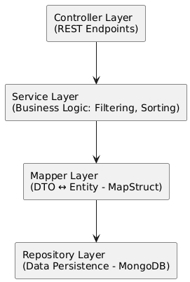

# 📦 Product Catalog API
Backend API for managing product catalogs, providing filtering, sorting, and search features. Developed with Spring Boot following a clean layered architecture.

---

## 🚀 Features
- CRUD operations for products.
- Advanced filtering and sorting (by name, price, category).
- Database integration with MongoDB.
- RESTful APIs with proper status codes & error handling.
- CORS enabled for frontend integration.

---

## 🛠️ Tech Stack
- Backend: Java 17, Spring Boot, Spring Data - MongoDB, Spring Validation
- Database: MongoDB
- Other: Lombok, MapStruct, JUnit/Mockito, Test Containers

---

## 📐 Architecture
- Pattern: layered (controller → service → repository)
- Diagram:

<p align="center">
  <br>
  <i>System Architecture Diagram</i>
</p>


---

## ⚙️ Installation & Setup
**Prerequisites**
- JDK 17+
- Maven


**1. Clone**

```bash
    git clone https://github.com/shongon-be/product-catalog.git
```

**2. Run locally**
```bash
    ./mvnw clean install
    ./mvnw spring-boot:run
```

API will be available at: http://localhost:8083/product-catalog/

--- 

## 📖 API Documentation

See details at [API-DOCS.md](./API-DOCS.md)

---

## 🧪 Testing
- Unit tests with JUnit & Mockito.
- Integration tests for controller & repository with Test Containers.

```bash
    ./mvnw test
```

---

## 🗺️ Roadmap  

- [ ] Implement caching with **Redis** for `viewAllProducts` endpoint  
- [ ] Integrate **Elasticsearch** for advanced product search  
- [ ] Dockerize application with **Docker** & **Docker Compose**  
- [ ] Deploy containerized project to **Railway** / **Render** / **AWS ECS** (after Dockerization)  

---

## 👨‍💻 Author
👤 Nguyen Tran Hong Son - SageDev
