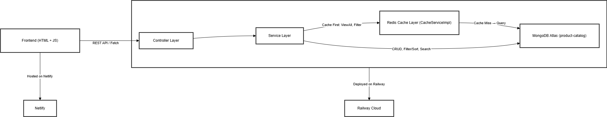

# 📦 Product Catalog API
**A clean and production-ready backend API** for managing product catalogs, featuring filtering, sorting, caching, searching and containerization.

Built with **Spring Boot** and designed to showcase **Clean Code practices, Git workflow, MongoDB indexing optimization, and Redis caching**.

---

## 🎯 Project Goals
- Demonstrate **clean architecture & code readability**.
- Apply **Redis caching** to improve performance (ViewAllProducts & FilterByCategory).
- Optimize **MongoDB indexes** for faster queries.
- Practice **team-ready Git workflow** (feature branching, PR reviews, semantic commits).
- Deploy with **Railway** and **Netlify**.

---

## 💻 Live Demo
- **Demo**: [product-catalog-service](https://product-catalog-service.netlify.app/)
- **API Documentation**: [Postman Docs](https://documenter.getpostman.com/view/38175419/2sB3HondyG) 
- **Postman Collection**: [📂 product-catalog.postman_collection.json](assets/resource/product-catalog.postman_collection.json)
---

## 🚀 Features
- **CRUD operations** for products.
- Advanced **filtering and sorting** (by name, price, category) and **searching by name** with **MongoDB**.
- **Caching with Redis** for high-performance API responses.
- **MongoDB Indexing** for query optimization.
- **RESTful Design** with proper status codes & error handling.
- **CORS** enabled for frontend integration.
- **Git Workflow**: feature-branch → PR → code review → merge.

---

## 🛠️ Tech Stack
- **Backend**: Java 17, Spring Boot, Spring Data MongoDB, Spring Validation.
- **Database**: MongoDB (with custom indexes), Redis (caching).
- **Testing**: JUnit 5, Mockito, Testcontainers.
- **Deployment**: Railway for `/backend`, Netlify for `/frontend`.
- **Other**: Docker, Lombok, MapStruct, Git, GitHub.

---

## 📑 API Endpoints (Summary)

| Method | Endpoint           | Description                 |
| ------ | ------------------ | --------------------------- |
| GET    | `/products`        | Get all products            |
| GET    | `/products/{id}`   | Get product by ID           |
| POST   | `/products`        | Create new product          |
| PUT    | `/products/{id}`   | Update product by ID        |
| DELETE | `/products/{id}`   | Delete product by ID        |
| GET    | `/products/filter` | Filter products by category |
| GET    | `/products/sort`   | Sort products (name/price)  |
| GET    | `/products/search`   | Search products (name)  |

---

## 📐 Architecture
- **Pattern**: monolith (controller → service → repository → cache).
- Controller Layer: Handle REST endpoints.
- Service Layer: Business logic (filtering, sorting & searching).
- Caching Layer: Redis with TTL & invalidation strategy
- Repository Layer: Data persistence (MongoDB).
- Mapper Layer: DTO ↔ Entity conversion using MapStruct.

**Diagram**:

<p align="center">
  <br>
  <i>System Architecture Diagram</i>
</p>


---

## ⚙️ Installation & Setup
**1. Prerequisites**
- JDK 17+
- Maven
- Docker

**2. Clone**

```bash
git clone https://github.com/shongon-be/product-catalog.git
cd product-catalog
```

**3. Set up .env**
```env
MONGO_DATABASE="your-db"
MONGO_USER="username"
MONGO_PASSWORD="password"
MONGO_CLUSTER="cluster"

REDIS_URL="url"
```

**4. Run locally**
```bash
mvn clean install
mvn spring-boot:run
```

---

## 📊 Diagrams
### 1. Filter & Sort Products
<p align="center">
  <br>
  <i> Filter Products sequence diagram.</i>
</p>

<p align="center">
  <br>
  <i> Sort Products sequence diagram.</i>
</p>

### 2. Cache Products (viewAllProducts & filterCategory)
<p align="center">
  <br>
  <i>Cache viewAllProducts sequence diagram.</i>
</p>

<p align="center">
  <br>
  <i>Cache filterCategory sequence diagram.</i>
</p>

<p align="center">
  <br>
  <i>Cache invalidationCUD sequence diagram.</i>
</p>

### 3. Search Product By Name
<p align="center">
  <br>
  <i>Search Product By Name sequence diagram.</i>
</p>

---

## 🧪 Testing & CI/CD

- **Unit/Integration tests**: 111 tests, Coverage: **100%**.
  - Unit tests (Service, Controller) with JUnit 5 & Mockito.
  - Integration tests with Testcontainers (MongoDB & Redis).
- **CI/CD**: basic CI/CD pipeline in Railway and Netlify.

---

## 🤝 Contributing

1. Fork the repo.

2. Create a feature branch: `git checkout -b feature/your-feature`

3. Commit with semantic messages. (`feat:`, `fix:`, `chore:`)

4. Open a PR → code review → merge.

---

## 📜 License

Distributed under the MIT License. See `LICENSE` for more info.

---

## 👨‍💻 Author
👤 **Nguyen Tran Hong Son** - Backend Developer (Java, Spring Boot)

📧 Contact: [LinkedIn](https://www.linkedin.com/in/son-nguyen-850585351/)
